# AetherLink - Secure Tunneling Solution

AetherLink is a **production-ready, secure tunneling solution** that creates HTTPS tunnels to expose your local services to the internet. Built with Go for performance and reliability, AetherLink provides enterprise-grade security with API key authentication while maintaining zero-configuration simplicity for authorized users.

The name "AetherLink" draws inspiration from the classical element "aether" - once thought to be the medium through which light traveled through space. Similarly, AetherLink serves as your secure medium for data transmission across the internet.


##  Features in v1.1.0

- **Pre-Shared API Keys**: Clients must authenticate before creating tunnels
- **Multi-Layer Security**: API keys + JWT tokens + rate limiting + IP whitelisting
- **Rogue Client Prevention**: Blocks unauthorized access even with known domain/IP
- **Security Monitoring**: Real-time authentication failure alerts
- **Auto-Cleanup**: Automatic removal of inactive tunnels
- **Admin API**: Comprehensive API key management

##  Core Features

- **Enterprise Security**: API key authentication prevents unauthorized tunnel creation
- **Zero Configuration**: Simple setup for authorized clients
- **Secure HTTPS**: All connections encrypted end-to-end
- **Custom Subdomains**: Request specific subdomains for your tunnels
- **WebSocket Support**: Full support for real-time applications
- **Cross-Platform**: Binaries for Linux, macOS, and Windows
- **Docker Ready**: Production-ready container images
- **Lightweight**: Minimal resource usage and fast startup
- **Load Balancing**: Multiple concurrent connections per tunnel

##  Quick Secure Setup

### 1. Server Setup (Production-Ready)

```bash
# Download latest server
wget https://github.com/hhftechnology/AetherLink/releases/latest/download/aetherlink-server-linux-amd64
chmod +x aetherlink-server-linux-amd64

# Start with authentication enabled
./aetherlink-server-linux-amd64 \
  --address=0.0.0.0 \
  --port=8080 \
  --domain=tunnel.company.com \
  --secure=true \
  --auth \
  --auth-token=your-super-secret-server-key

# Server output:
#  Authentication is ENABLED
#    - Clients must provide valid API keys
#    - Use --create-api-key to generate client keys
```

### 2. Create API Keys for Authorized Clients

```bash
# Create API key for development team
./aetherlink-server-linux-amd64 \
  --auth-token=your-super-secret-server-key \
  --create-api-key="development-team" \
  --admin

# Output:
#    API Key created successfully!
#    Key: ak_1a2b3c4d5e6f7g8h9i0j1k2l3m4n5o6p7q8r9s0t1u2v3w4x5y6z
```

### 3. Secure Client Usage

```bash
# Download client
wget https://github.com/hhftechnology/AetherLink/releases/latest/download/aetherlink-client-linux-amd64
chmod +x aetherlink-client-linux-amd64

# Authorized client (works)
./aetherlink-client-linux-amd64 \
  --server=https://tunnel.company.com \
  --port=3000 \
  --subdomain=myapp \
  --api-key=ak_1a2b3c4d5e6f7g8h9i0j1k2l3m4n5o6p7q8r9s0t1u2v3w4x5y6z

# Rogue client (blocked)
./aetherlink-client-linux-amd64 \
  --server=https://tunnel.company.com \
  --port=3000
#  Authentication failed: API key required
```

##  Docker Deployment (Secure)

### Server with Authentication

```bash
# Generate secure server secret
export AETHERLINK_AUTH_SECRET="$(openssl rand -hex 32)"

# Run secure server
docker run -d \
  --name aetherlink-server \
  -p 8080:8080 -p 62322:62322 \
  -e AETHERLINK_AUTH_SECRET="$AETHERLINK_AUTH_SECRET" \
  hhftechnology/aetherlink-server:latest \
  --address=0.0.0.0 \
  --port=8080 \
  --domain=tunnel.company.com \
  --secure=true \
  --auth

# Create API keys
docker exec aetherlink-server \
  /aetherlink-server \
  --create-api-key="team-dev" \
  --admin
```

### Production Docker Compose

```yaml
# docker-compose.yml
services:
  aetherlink-server:
    image: hhftechnology/aetherlink-server:latest
    restart: unless-stopped
    ports:
      - "8080:8080"
      - "62322:62322"
    environment:
      - AETHERLINK_AUTH_SECRET=${AETHERLINK_AUTH_SECRET}
    command: [
      "--address=0.0.0.0",
      "--port=8080",
      "--domain=tunnel.company.com",
      "--secure=true",
      "--auth",
      "--issuer=company-tunnel-server"
    ]
    healthcheck:
      test: ["CMD", "curl", "-f", "http://localhost:8080/api/status"]
      interval: 30s
      timeout: 10s
      retries: 3
```

##  Security Architecture

### Authentication Flow

```mermaid
sequenceDiagram
    participant R as Rogue Client
    participant A as Authorized Client  
    participant S as AetherLink Server
    participant L as Local Service

    R->>S: Request tunnel (no API key)
    S->>R: ❌ HTTP 401: API key required
    
    A->>S: Request tunnel + API key
    S->>S: Validate API key
    S->>A: ✅ Tunnel info + JWT token
    
    A->>S: Connect with tunnel ID + JWT
    S->>S: Validate JWT token
    S->>A: ✅ Tunnel established
    
    Note over A,S: Secure tunnel active
    A->>S: HTTP requests
    S->>L: Proxy to local service
```



### Security Layers

1. **API Key Authentication**: Prevents unauthorized tunnel creation
2. **JWT Tokens**: Secures tunnel connections
3. **Rate Limiting**: Blocks brute force attacks
4. **IP Whitelisting**: Network-level access control
5. **Monitoring**: Real-time security event tracking

##  Installation

### From GitHub Releases (Recommended)

```bash
# Server
wget https://github.com/hhftechnology/AetherLink/releases/latest/download/aetherlink-server-linux-amd64
chmod +x aetherlink-server-linux-amd64

# Client  
wget https://github.com/hhftechnology/AetherLink/releases/latest/download/aetherlink-client-linux-amd64
chmod +x aetherlink-client-linux-amd64
```

### From Source

```bash
git clone https://github.com/hhftechnology/AetherLink.git
cd AetherLink
go mod download
go build -o aetherlink-server ./cmd/lt-server
go build -o aetherlink-client ./cmd/lt-client
```

### Using Go Install

```bash
go install github.com/hhftechnology/AetherLink/cmd/lt-server@latest
go install github.com/hhftechnology/AetherLink/cmd/lt-client@latest
```

## Configuration

### Server Options

```bash
./aetherlink-server [options]
```

| Option | Default | Description |
|--------|---------|-------------|
| `--address` | "127.0.0.1" | Server bind address |
| `--port` | "8080" | Server port |
| `--domain` | "" | Domain for subdomain routing |
| `--secure` | false | Enable HTTPS mode |
| `--auth` | false | **Enable API key authentication** |
| `--auth-token` | "" | **Server authentication secret** |
| `--issuer` | "aetherlink-server" | JWT token issuer |
| `--create-api-key` | "" | **Create API key (admin mode)** |
| `--list-keys` | false | **List all API keys** |

### Client Options

```bash
./aetherlink-client [options]
```

| Option | Default | Description |
|--------|---------|-------------|
| `--server` | "http://localhost:80" | Server URL |
| `--port` | "80" | Local port to expose |
| `--subdomain` | "" | Custom subdomain |
| `--api-key` | "" | **API key for authentication** |

## Production Security Setup

### 1. Secure Server Deployment

```bash
# Generate strong secrets
SERVER_SECRET=$(openssl rand -hex 32)
export AETHERLINK_AUTH_SECRET="$SERVER_SECRET"

# Start production server
./aetherlink-server \
  --address=0.0.0.0 \
  --port=8080 \
  --domain=tunnel.company.com \
  --secure=true \
  --auth \
  --issuer=company-production-server
```

### 2. API Key Management

```bash
# Create team-specific API keys
./aetherlink-server --create-api-key="frontend-team" --admin
./aetherlink-server --create-api-key="backend-team" --admin
./aetherlink-server --create-api-key="devops-team" --admin

# Create API key with IP restrictions
./aetherlink-server \
  --create-api-key="production-ci" \
  --ip-whitelist="203.0.113.0/24,198.51.100.10" \
  --admin

# List all API keys
./aetherlink-server --list-keys --admin
```

### 3. Client Distribution

```bash
# Secure distribution to team members
export AETHERLINK_API_KEY="ak_team_key_here"

# Team member usage
./aetherlink-client \
  --server=https://tunnel.company.com \
  --port=3000 \
  --subdomain=alice-frontend
```

## Real-World Usage Examples

### Secure Development Environment

```bash
# 1. Start secure server
./aetherlink-server \
  --address=0.0.0.0 \
  --auth \
  --auth-token=dev-server-secret \
  --domain=dev.company.com

# 2. Create development API key
./aetherlink-server \
  --create-api-key="development" \
  --admin \
  --auth-token=dev-server-secret

# 3. Developers use API key
./aetherlink-client \
  --server=https://dev.company.com \
  --port=3000 \
  --subdomain=react-app \
  --api-key=ak_development_key

# Result: https://react-app.dev.company.com (secure)
```

### Production Staging Environment

```bash
# 1. Production server with IP restrictions
./aetherlink-server \
  --address=0.0.0.0 \
  --auth \
  --auth-token=$PRODUCTION_SECRET \
  --domain=staging.company.com

# 2. Create restricted API key for CI/CD
./aetherlink-server \
  --create-api-key="github-actions" \
  --ip-whitelist="140.82.112.0/20" \
  --admin \
  --auth-token=$PRODUCTION_SECRET

# 3. CI/CD pipeline usage
./aetherlink-client \
  --server=https://staging.company.com \
  --port=4173 \
  --subdomain=pr-$PR_NUMBER \
  --api-key=$GITHUB_ACTIONS_API_KEY

# Result: https://pr-123.staging.company.com (IP-restricted)
```

### Team Collaboration

```bash
# Different teams, different subdomains, same security
./aetherlink-client --api-key=$FRONTEND_KEY --subdomain=frontend-alice
./aetherlink-client --api-key=$BACKEND_KEY --subdomain=api-bob  
./aetherlink-client --api-key=$MOBILE_KEY --subdomain=mobile-charlie

# All protected with authentication
```

## API Endpoints

### Public Endpoints

- `GET /api/status` - Server status and statistics
- `GET /api/tunnels/{id}/status` - Tunnel-specific status

### Tunnel Creation (Requires API Key)

- `GET /?new` - Create tunnel with random subdomain
- `GET /{subdomain}` - Create tunnel with custom subdomain

### Admin Endpoints (Requires API Key)

- `GET /api/admin/keys` - List all API keys
- `POST /api/admin/keys` - Create new API key
- `DELETE /api/admin/keys/{key}` - Delete API key

### Example API Usage

```bash
# Check server status (public)
curl https://tunnel.company.com/api/status

# Create tunnel (requires API key)
curl -H "Authorization: Bearer $API_KEY" \
  https://tunnel.company.com/?new

# Admin: List API keys
curl -H "Authorization: Bearer $ADMIN_KEY" \
  https://tunnel.company.com/api/admin/keys
```

## Firewall Configuration

**Required Ports:**

| Port | Protocol | Purpose |
|------|----------|---------|
| 8080 | TCP | HTTP/HTTPS server |
| 62322 | TCP | Tunnel connections |
| 80 | TCP | HTTP redirects (optional) |
| 443 | TCP | HTTPS (with reverse proxy) |

**Firewall Setup:**

```bash
# Ubuntu/Debian (ufw)
sudo ufw allow 8080/tcp
sudo ufw allow 62322/tcp
sudo ufw allow 80/tcp
sudo ufw allow 443/tcp

# CentOS/RHEL (firewalld)
sudo firewall-cmd --permanent --add-port=8080/tcp
sudo firewall-cmd --permanent --add-port=62322/tcp
sudo firewall-cmd --permanent --add-port=80/tcp
sudo firewall-cmd --permanent --add-port=443/tcp
sudo firewall-cmd --reload

# Manual iptables
iptables -A INPUT -p tcp --dport 8080 -j ACCEPT
iptables -A INPUT -p tcp --dport 62322 -j ACCEPT
```

## Advanced Deployments

### Kubernetes with Security

```yaml
apiVersion: apps/v1
kind: Deployment
metadata:
  name: aetherlink-server
spec:
  replicas: 2
  template:
    spec:
      containers:
      - name: aetherlink-server
        image: hhftechnology/aetherlink-server:latest
        args:
          - "--address=0.0.0.0"
          - "--port=8080"
          - "--domain=tunnel.company.com"
          - "--secure=true"
          - "--auth"
        env:
        - name: AETHERLINK_AUTH_SECRET
          valueFrom:
            secretKeyRef:
              name: aetherlink-secrets
              key: auth-secret
        resources:
          limits:
            memory: "512Mi"
            cpu: "500m"
        securityContext:
          runAsNonRoot: true
          readOnlyRootFilesystem: true
```

### AWS with Secrets Manager

```bash
# Store secrets in AWS Secrets Manager
aws secretsmanager create-secret \
  --name "aetherlink/auth-secret" \
  --secret-string "$(openssl rand -hex 32)"

# EC2 user data script
#!/bin/bash
SECRET=$(aws secretsmanager get-secret-value \
  --secret-id "aetherlink/auth-secret" \
  --query SecretString --output text)

docker run -d \
  -e AETHERLINK_AUTH_SECRET="$SECRET" \
  -p 8080:8080 -p 62322:62322 \
  hhftechnology/aetherlink-server:latest \
  --auth --domain=tunnel.company.com
```

## Monitoring & Security

### Security Event Monitoring

```bash
# Monitor authentication failures
tail -f /var/log/aetherlink/server.log | grep "authentication failed" | \
while read line; do
  echo "SECURITY ALERT: $line"
  # Send to monitoring system
done

# Rate limiting alerts
tail -f /var/log/aetherlink/server.log | grep "rate limit exceeded" | \
while read line; do
  IP=$(echo "$line" | grep -oE '([0-9]{1,3}\.){3}[0-9]{1,3}')
  echo "RATE LIMIT: IP $IP blocked"
done
```

### Health Checks

```bash
# Server health with authentication status
curl https://tunnel.company.com/api/status

# Response includes security info:
{
  "tunnels": 5,
  "auth_enabled": true,
  "tunnel_port": 62322,
  "mem": {...}
}
```

##  Migration Guide

### Upgrading from v1.0.x (No Auth) to v1.1.0 (With Auth)

**Existing Deployments (Backward Compatible):**
```bash
# Your existing setup continues to work
./aetherlink-server --address=0.0.0.0 --port=8080
# ⚠️ Authentication disabled - still works but not secure
```

**Enable Security (Recommended):**
```bash
# 1. Add authentication to existing server
./aetherlink-server \
  --address=0.0.0.0 \
  --port=8080 \
  --auth \
  --auth-token=your-secret-key

# 2. Create API keys for existing clients
./aetherlink-server --create-api-key="existing-clients" --admin

# 3. Update clients with API keys
./aetherlink-client \
  --server=https://your-server.com \
  --port=3000 \
  --api-key=ak_generated_key
```

##  Security Best Practices

###  Do's

- **Enable authentication** in production (`--auth` flag)
- **Use strong secrets** (32+ characters, random)
- **Store secrets securely** (environment variables, secret managers)
- **Rotate API keys regularly** (quarterly recommended)
- **Use IP whitelisting** for sensitive environments
- **Monitor authentication failures** and set up alerts
- **Use HTTPS** in production (`--secure` flag)

###  Don'ts

- **Never put API keys in source code** or command line history
- **Don't use weak server secrets** (dictionary words, short keys)
- **Don't share API keys** between different teams/environments
- **Don't run without authentication** in production
- **Don't ignore security logs** and monitoring alerts

##  Troubleshooting

### Authentication Issues

**1. API Key Required Error:**
```bash
# Error: authentication failed: API key required
# Solution: Provide valid API key
./aetherlink-client --api-key=ak_your_key_here --server=https://server.com --port=3000
```

**2. Invalid API Key Error:**
```bash
# Error: authentication failed: invalid API key  
# Solution: Check API key or create new one
./aetherlink-server --create-api-key="new-client" --admin
```

**3. Rate Limit Exceeded:**
```bash
# Error: rate limit exceeded for IP X.X.X.X
# Solution: Wait or contact administrator to whitelist IP
```

### Connection Issues

**1. Connection Refused:**
```bash
# Check server is running and accessible
curl https://your-server.com/api/status

# Verify firewall allows ports 8080 and 62322
sudo ufw status
```

**2. Subdomain Already Exists:**
```bash
# Error: ID myapp already exists
# Solution: Choose different subdomain or wait for timeout
./aetherlink-client --subdomain=myapp-v2 --server=https://server.com
```

##  Performance & Limits

- **Latency**: < 50ms additional latency
- **Throughput**: Full network bandwidth utilization
- **Connections**: 10 concurrent connections per tunnel (configurable)
- **Memory**: ~10MB base + ~1MB per active tunnel
- **Tunnels**: No hard limit (dependent on server resources)
- **Rate Limiting**: 10 requests/minute per IP (configurable)

##  Contributing

We welcome security-focused contributions! Please see our [contributing guidelines](CONTRIBUTING.md).

**Security-related contributions especially welcome:**
- Additional authentication methods
- Enhanced monitoring and alerting
- Security vulnerability reports
- Documentation improvements

1. Fork the repository
2. Create your feature branch (`git checkout -b feature/security-enhancement`)
3. Commit your changes (`git commit -m 'Add security feature'`)
4. Push to the branch (`git push origin feature/security-enhancement`)
5. Open a Pull Request

##  License

This project is licensed under the Apache License 2.0 - see the [LICENSE](LICENSE) file for details.

##  Support

- **Security Issues**: [security@hhftechnology.com](mailto:security@hhftechnology.com)
- **Bug Reports**: [GitHub Issues](https://github.com/hhftechnology/AetherLink/issues)
- **Feature Requests**: [GitHub Discussions](https://github.com/hhftechnology/AetherLink/discussions)
- **Documentation**: [Wiki](https://github.com/hhftechnology/AetherLink/wiki)

##  Changelog

### v1.1.0 (Current) - Security Release
- ✅ **API Key Authentication** - Prevents unauthorized tunnel creation
- ✅ **JWT Token Security** - Secures tunnel connections
- ✅ **Rate Limiting** - Blocks brute force attacks
- ✅ **IP Whitelisting** - Network-level access control
- ✅ **Admin API** - Comprehensive key management
- ✅ **Security Monitoring** - Real-time event tracking
- ✅ **Auto-cleanup** - Removes inactive tunnels

### v1.0.0 - Initial Release
- ✅ Basic tunneling functionality
- ✅ HTTP/HTTPS support
- ✅ WebSocket support
- ✅ Docker images
- ✅ Cross-platform binaries

##  Acknowledgments

- Built with [Go](https://golang.org/) for performance and reliability
- JWT authentication powered by [golang-jwt](https://github.com/golang-jwt/jwt)
- Security-first design inspired by enterprise best practices
- Thanks to the security community for vulnerability reports and suggestions
- Inspired by ngrok and similar tunneling solutions

---

<p align="center">
  <strong> AetherLink - Secure tunneling that actually keeps the bad guys out</strong><br>
  Built with ❤️ and 🛡️ for developers who care about security
</p>

## 🔗 Quick Links

- [ Quick Start](#-quick-secure-setup)
- [ Security Guide](docs/security-guide.md)
- [ Deployment Examples](docs/deployment-scenarios.md)
- [ API Documentation](docs/api-reference.md)
- [ Docker Hub](https://hub.docker.com/r/hhftechnology/aetherlink-server)
- [ GitHub Releases](https://github.com/hhftechnology/AetherLink/releases)